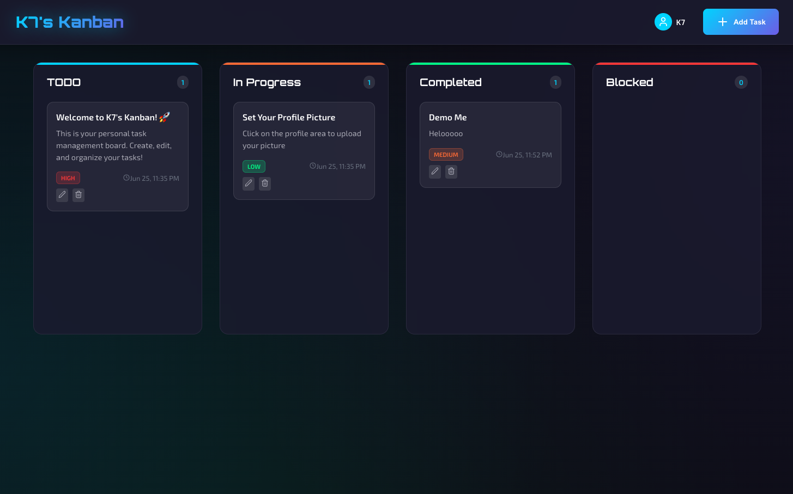

# 🚀 K7's Futuristic Kanban Board

A modern, elegant Kanban board application built with React and Node.js featuring a futuristic design with glassmorphism effects, neon gradients, and smooth animations.



## ✨ Features

- **Drag & Drop**: Seamlessly move tasks between columns
- **Task Management**: Create, edit, and delete tasks
- **Four Columns**: TODO, In Progress, Completed, and Blocked
- **Priority Levels**: High, Medium, and Low priority tasks
- **Futuristic UI**: Modern design with glassmorphism and neon effects
- **Responsive Design**: Works on desktop and mobile devices
- **Real-time Updates**: Instant synchronization with backend

## 🛠️ Tech Stack

### Frontend
- React 19 with TypeScript
- React Beautiful DND for drag & drop
- Lucide React for icons
- Framer Motion for animations
- Axios for API calls
- CSS3 with custom properties and glassmorphism

### Backend
- Node.js with Express
- CORS enabled
- RESTful API
- In-memory data storage (easily replaceable with database)

## 🚀 Quick Start

### Prerequisites
- Node.js (v14 or higher)
- npm or yarn

### Backend Setup

1. Navigate to the backend directory:
```bash
cd backend
```

2. Install dependencies:
```bash
npm install
```

3. Start the backend server:
```bash
npm run dev
```

The backend will run on `http://localhost:3001`

### Frontend Setup

1. Navigate to the frontend directory:
```bash
cd frontend
```

2. Install dependencies:
```bash
npm install --legacy-peer-deps
```

3. Start the frontend development server:
```bash
npm start
```

The frontend will run on `http://localhost:3000`

## 📁 Project Structure

```
futuristic-kanban/
├── backend/
│   ├── package.json
│   └── server.js
├── frontend/
│   ├── public/
│   ├── src/
│   │   ├── components/
│   │   │   ├── AddTaskModal.tsx
│   │   │   ├── EditTaskModal.tsx
│   │   │   ├── KanbanColumn.tsx
│   │   │   └── TaskCard.tsx
│   │   ├── services/
│   │   │   └── api.ts
│   │   ├── types/
│   │   │   └── index.ts
│   │   ├── App.css
│   │   ├── App.tsx
│   │   └── index.tsx
│   └── package.json
└── README.md
```

## 🎨 Design Features

### Color Scheme
- **Primary Background**: Deep space black (`#0a0a0f`)
- **Secondary Background**: Dark navy (`#1a1a2e`)
- **Accent Blue**: Bright cyan (`#00d4ff`)
- **Accent Purple**: Modern purple (`#6c5ce7`)
- **Accent Green**: Neon green (`#00ff88`)
- **Accent Orange**: Vibrant orange (`#ff6b35`)
- **Accent Red**: Alert red (`#ff3838`)

### Visual Effects
- Glassmorphism cards with backdrop blur
- Gradient text effects
- Hover animations with glow effects
- Smooth transitions and transforms
- Custom scrollbars
- Responsive grid layout

## 🔧 API Endpoints

### Tasks
- `GET /api/tasks` - Get all tasks
- `GET /api/tasks/:id` - Get task by ID
- `POST /api/tasks` - Create new task
- `PUT /api/tasks/:id` - Update task
- `PATCH /api/tasks/:id/status` - Update task status
- `DELETE /api/tasks/:id` - Delete task

### Health Check
- `GET /api/health` - Server health check

## 📱 Usage

1. **Adding Tasks**: Click the "Add Task" button in the header
2. **Editing Tasks**: Click the edit icon on any task card
3. **Moving Tasks**: Drag and drop tasks between columns
4. **Deleting Tasks**: Click the delete icon on any task card
5. **Priority Levels**: Set task priorities (High, Medium, Low)

## 🔮 Future Enhancements

- [ ] Database integration (PostgreSQL/MongoDB)
- [ ] User authentication and authorization
- [ ] Real-time collaboration with WebSockets
- [ ] Task due dates and reminders
- [ ] File attachments
- [ ] Task comments and activity log
- [ ] Team workspaces
- [ ] Advanced filtering and search
- [ ] Dark/Light theme toggle
- [ ] Mobile app with React Native

## 🐛 Troubleshooting

### Common Issues

1. **CORS Errors**: Make sure the backend is running on port 3001
2. **Dependency Conflicts**: Use `--legacy-peer-deps` flag when installing frontend dependencies
3. **Port Already in Use**: Change the port in backend/server.js or frontend package.json

### Environment Variables

Create a `.env` file in the frontend directory for custom API URL:
```
REACT_APP_API_URL=http://localhost:3001/api
```

## 📄 License

This project is licensed under the MIT License - see the LICENSE file for details.

## 🤝 Contributing

1. Fork the repository
2. Create a feature branch (`git checkout -b feature/amazing-feature`)
3. Commit your changes (`git commit -m 'Add amazing feature'`)
4. Push to the branch (`git push origin feature/amazing-feature`)
5. Open a Pull Request

## 👨‍💻 Author

Built with ❤️ using modern web technologies

---

**Happy Coding!** 🚀
